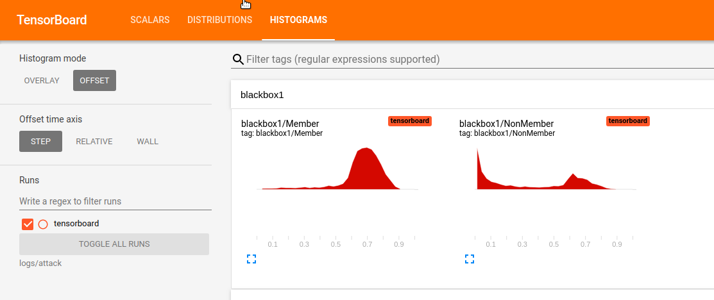
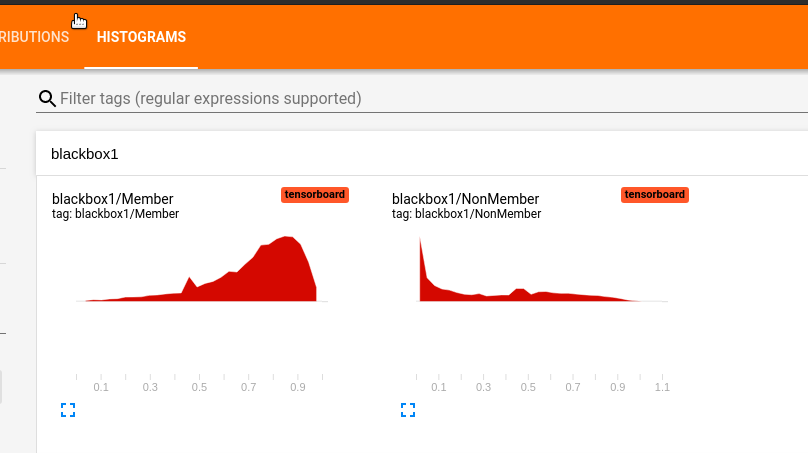
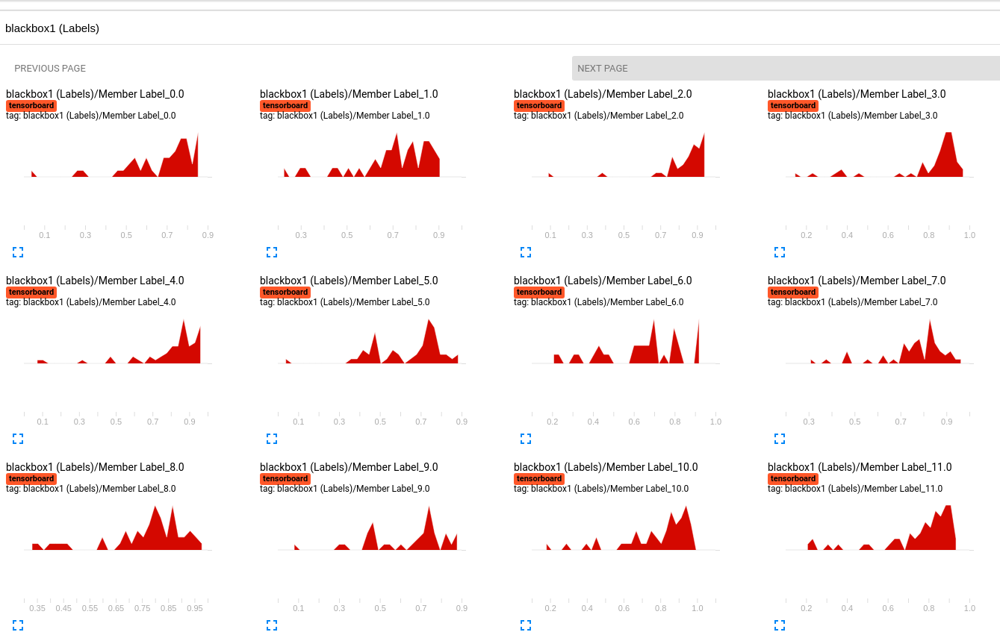
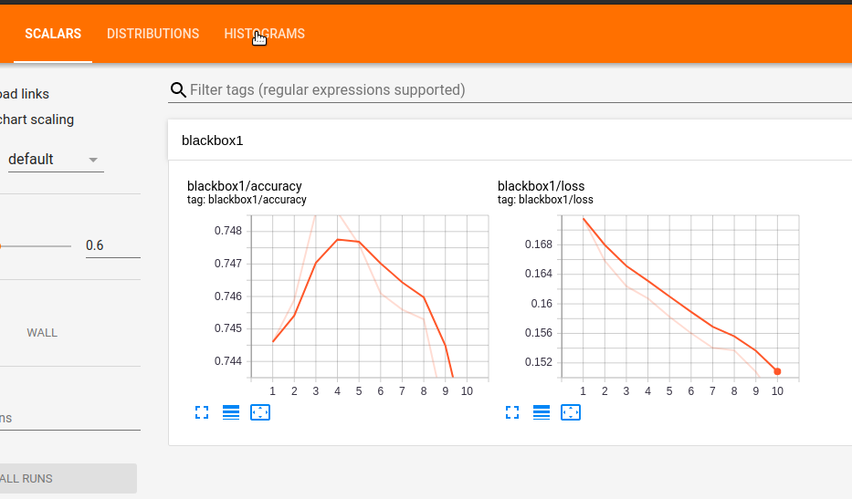
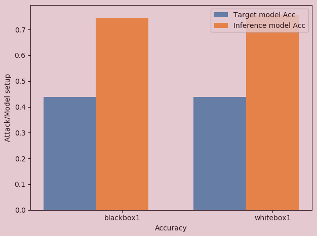

# ML Privacy Meter

`ml_privacy_meter` is a python library to carry out membership inference attacks (whitebox or blackbox) against already trained models, which can help benchmark the membership information leakage of such models. The tool generates attacks on a target model assuming blackbox or whitebox access to the target model to get the inference accuracy of the attack. Whitebox attacks can exploit the target model's parameters to infer training set membership of the input, while blackbox attacks only use the target model's predictions to infer data membership. 

## Setup

### Dependencies

The API is built on top of `TensorFlow 2.1` with Python 3.6. `TensorFlow` can be installed [in a virtual environment](https://www.tensorflow.org/install/pip#2.-create-a-virtual-environment-recommended).

### To activate `virtualenv`:
```
~$ python3 -m virtualenv ~/path/to/venv
~$ source ~/path/to/venv/bin/activate
```

### Installing `ml_privacy_meter` on local machine

**1**. Clone this repository:
```
~$ cd ml_privacy_meter/
```

**2**.  Install all the dependencies:
```
~$ pip install -r requirements.txt
```

**3**. Install the library locally on your machine:
```
~$ pip install -e .
```
The library uses GPU for optimal execution. For more details on TensorFlow GPU support, [look here](https://www.tensorflow.org/install/gpu).

**Note** :  Though `ml_privacy_meter` makes use of the [Eager Execution](https://www.tensorflow.org/guide/eager) mode of TensorFlow, `"tf.enable_eager_execution()"` need not be called explicitly. Importing `ml_privacy_meter` will do that job for you.


# Overview

- `ml_privacy_meter.attack` consists of attacks that can be mounted against trained machine learning models. The tool implements the blackbox and whitebox membership inference attack described in Shokri, Stronati, Song, Shmatikov [1], and Nasr, Shokri, Houmansadr [2]. The tool is designed and developed at NUS Data Privacy and Trustworthy Machine Learning Lab, by (alphabetical order): Mihir Harshavardhan Khandekar, Milad Nasr, Shadab Shaikh, and Reza Shokri.

## Data 

To use `ml_privacy_meter's` datahandler, the datasets need to be in a particular format.  README in `datasets/`  directory contain the details about the required format. It also consists of scripts to download some datasets in the required format. 

## Attacking a Trained Model
`ml_privacy_meter.attacks.whitebox` can be used to attack any target classification model using the method is given in Nasr et al [2]. 
With `ml_privacy_meter`, helps create a customized attack model by choosing the elements of an already trained classification model. This could include the gradients (of layers with trainable parameters), intermediate outputs of hidden layers, output of the target model and value of loss function to train the inference model.  

#### Sample code to initialize whitebox attack
In the below example, the number of epochs is set to 100 and the attack model exploits the intermediate activations of last 3 layers and the gradients of the last layer on a Fully connected Neural Network as the target model. This target model consists of 5 layers. Here, both the target classification models (used for training and the one evaluated on) are the same, but they can differ [See Note 1]. For the `blackbox` attack (exploiting only the output of final classification layer), the output dimension of Model A and B needs to be the same, whereas rest of the architecture can be different. For `whitebox` attack, the architectures need to be same. The difference between Model A and Model B for such an attack is that Model B could be trained on a different dataset.

Important arguments among them:

- dataset_path : path to the whole dataset (in .txt format). This is required to sample non-members.
- saved_path: Path of the saved training data of the target classification model. It has to be in a `.npy` format. The saved dataset is used to sample members.
- batch_size: batch size for training the attack model.
- attack_percentage: percentage of training data that'll be used for attack. This fraction will determine the number of members and non members that'll form the training dataset for attack model.

To attack:
```
attackobj = ml_privacy_meter.attacks.whitebox.initialize(
                 target_train_model=cmodel, 
                 target_attack_model=cmodel, 
                 train_datahandler=datahandler, 
                 attack_datahandler=datahandler, 
                 optimizer="adam", 
                 layers_to_exploit = [3,4,5],
                 gradients_to_exploit = [5],
                 exploit_loss=True,
                 exploit_label=True,                 
                 learning_rate=0.0001, 
                 epochs=100)

 # Begins training the attack model. 
attackobj.train_attack()             
 
 # The attack accuracy for the attack model is evaluated during training itself on a 
 # validation/ test set that is reported on the best performing attack model 
 # (out of all the epochs).
```        

The description of the arguments:

- `target_train_model`: the target classification model used to train the attack model  
- `target_attack_model`: the target classification  model used to evaluate the attack model   [See Note 2]
- `train_datahandler`: datahandler of `target_train_model`
- `attack_datahandler`: datahandler of `target_attack_model` 
- `optimizer`: `optimizer` op for training the attack model.
- `layers_to_exploit`: a list of layer indices of which the intermediate outputs will be exploited. This should be the index of the layer in the model.
- `gradients_to_exploit`: a list of layer indices of which the gradients will be exploited. This should be the index of the layers with trainable parameters.
- `exploit_loss`: Boolean. `True` implies loss value of the target model will be exploited. 
- `exploit_label`: Boolean. `True` implies one-hot encoded labels will be exploited.                 
- `learning_rate`: learning rate of the optimizer op
- `epochs`: The number of epochs to train the attack model.

Note 1: The `whitebox` class can also be used to train the whitebox attack model on a target classification model (call it model A) and evaluate it on a different classification model (call it model B). Model A's training set is used for training the attack model and model B's test set is used for evaluating the attack model (with no intersection among them).

Note 2: The `target_attack_model` is not a attack model but rather a classification model that the attack model will be evaluated on.

A tutorial to run the attack on CIFAR-100 Alexnet model can be found [here](tutorials/README.md).

### Available optimizers:

1. AdaDelta
2. AdaGrad
3. Adam
4. Vanilla SGD
5. SGD with Momentum
6. RMSProp

## Visualization
The attack models can also be visualized in Tensorboard's dashboard. The user can view the privacy risk of the model, compare privacy risk for multiple models, compare privacy risk between datapoints with different labels. They can also view the inference model graph, attack accuracy at each epoch. Additionally, if multiple models are trained, the target model training accuracies and inference model attack accuracies can be compared. This comparison can be done between multiple target models on the same data, or multiple attack configurations (Example : Blackbox vs whitebox).
To create the visualizations, the user needs to call
```
attackobj.test_attack()
```
This function can be called for different instances of the attack setup, `attackobj` (ml_privacy_meter.attack.whitebox) to compare them.

A PDF report is generated for the data, which includes histograms for privacy leakage, ROC curve for the membership probabilities, gradient norm distributions for member and non-member data, and label-wise privacy leakage plots. This data is created in the `logs` folder as `report.pdf`. A sample report is present [here](logs/report.pdf).

To view the data on Tensorboard, the following command is run. The command output returns a URL, which can be accessed via a browser.
```
tensorboard --bind_all --logdir logs/attack
```



A histogram of the privacy risk of the models can be viewed in the histogram tab. Here, a membership probability of 0 corresponds to a greater chance of datapoints being non-members of the training set, while 1 corresponds to a greater chance of being in the training set. 


The privacy risk can also be viewed for each label in the same tab. 


The accuracy and loss of the attack model while getting trained can be visualized in the Scalars tab.


A `comparison.png` graph is also created to compare multiple runs of the attack, with the inference accuracy and target model test accuracy.



The `logs/attack` folder can be deleted to refresh the data.

## References:

1. R. Shokri, M. Stronati, C. Song, and V. Shmatikov. [Membership Inference Attacks against Machine Learning Models](https://www.comp.nus.edu.sg/~reza/files/Shokri-SP2017.pdf) in IEEE Symposium on Security and Privacy, 2017.
2. M. Nasr, R. Shokri, and A. Houmansadr. [Comprehensive Privacy Analysis of Deep Learning: Stand-alone and Federated Learning under Passive and Active White-box Inference Attacks](https://www.comp.nus.edu.sg/~reza/files/Shokri-SP2019.pdf) in IEEE Symposiumon Security and Privacy, 2019.
3.  Moritz Hardt, Benjamin Recht, and Yoram Singer. Train faster, generalize
better: Stability of stochastic gradient descent, [arXiv preprint:arXiv:1509.01240 (2015)].
