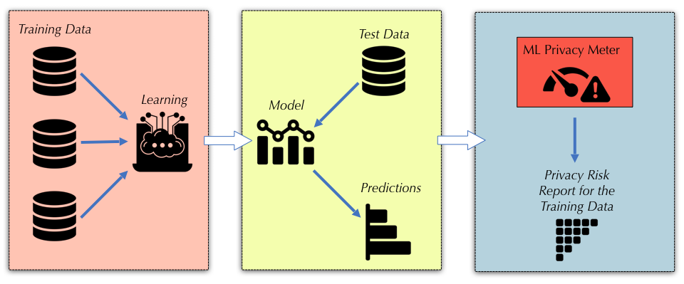
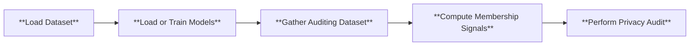
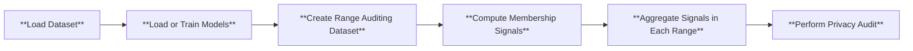
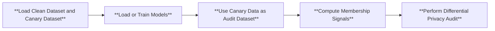

# Privacy Meter


[](https://join.slack.com/t/privacy-meter/shared_invite/zt-2t6881rtz-gNitEpoaO7MDU4wT3n7Gyw)
[](https://opensource.org/licenses/MIT)
[](https://arxiv.org/abs/2007.09339)


[](https://colab.research.google.com/github/privacytrustlab/ml_privacy_meter/blob/master/demo.ipynb)


## What is Privacy Meter?

Privacy Meter is an open-source library to audit data privacy in a wide range of statistical and machine learning algorithms (classification, regression, computer vision, and natural language processing). The tool enables data protection impact assessment based on the state-of-the-art membership inference attacks. 


## Why Privacy Meter?

Machine learning is playing a central role in automated decision-making in a wide range of organizations and service providers. The data, which are used to train the models, typically contain sensitive information about individuals. Although the data in most cases cannot be released, due to privacy concerns, the models are usually made public or deployed as a service for inference on new test data. For a safe and secure use of machine learning models, it is important to have a quantitative assessment of the privacy risks of these models, and to make sure that they do not reveal sensitive information about their training data. This is of great importance as there has been a surge in the use of machine learning in sensitive domains such as medical and finance applications.

Data Protection regulations, such as GDPR and AI governance frameworks, require personal data to be protected when used in AI systems, and that the users have control over their data and awareness about how it is being used. For example, [Article 35 of GDPR](https://gdpr-info.eu/art-35-gdpr/) requires organizations to systematically analyze, identify and minimize the data protection risks of a project, especially when the project involves innovative technologies such as Artificial Intelligence, Machine Learning, and Deep Learning. Thus, proper mechanisms need to be in place to quantitatively evaluate and verify the privacy of individuals in every step of the data processing pipeline in AI systems.

## Functionality
Privacy Meter supports auditing the privacy risk of ML models with different privacy notions. This is done by supporting multiple inference attacks:
1. Membership inference attack (MIA)
2. Range membership inference attack (RaMIA)
3. Dataset usage cardinality inference attack (DUCI)

It also supports auditing differentially private (DP) algorithms and models with any of these attacks above.

### Applicable model classes and their tasks
Privacy Meter supports various model classes. By default, we support MLPs and WideResNets for classification tasks. We also support LLMs for text generation.

## Overview
Privacy Meter supports different types of models, datasets and privacy games, which all need to be specified in a `.yaml` configuration file. The description of the configuration file can be found [here](configs/README.md).

<p align="center">
  
</p>

Below is the high level pipeline of the internal mechanism of Privacy Meter, which shows the general procedure involved in auditing privacy according to the configuration.



For **Range membership inference**, we modify the pipeline in auditing dataset creation by replacing each point query to range query. In the signal computation step, samples are taken in each range query, before their signals are aggregated in the new signal aggregation step to create the RangeMIA score. Below is the flowchart for RaMIA:



For **auditing differential privacy lower bounds**, we  modify the pipeline in dataset creation by performing i.i.d. Poisson sampling from a prespecified canary dataset, and by combing the subsampled canary data points with the clean dataset. We also extend the pipeline in `perform privacy audit` to provide the audited differential privacy lower bounds under different number of MIA guesses. Below is the flowchart for DP auditing:



## User Manual
### Getting started
To install the dependencies, run the following command:
```
pip install -r requirements.txt
```
Alternatively, if you prefer using conda, you can create a new environment using the provided `env.yaml` file:
```
conda env create -f env.yaml
```
This should create a conda environment named `privacy_meter` and install all necessary libraries in it. If conda takes too much time (more than a few minutes) to solve the environment, we suggest updating the conda default solver by following this official [article](https://www.anaconda.com/blog/a-faster-conda-for-a-growing-community).

### Membership inference attacks
To run our demo, you can use the following command

```
python main.py --cf configs/config.yaml
```

The `.yaml` file allows you to specify the hyperparameters for training the model, and the details of the membership inference attack. To shorten the time to run the demo, we set the number of epochs to 10. To properly audit the privacy risk, we suggest change the number of epochs to 100 or whatever is appropriate for your use case.

For a comprehensive explanation of each parameter, please refer to each `.yaml` file and the explanation [here](configs/README.md). You can also refer to the [demo notebook](demo.ipynb) for a step-by-step walkthrough. Upon audit completion, you will find the results in the `demo` folder, with the attack results saved in `demo/report`. Furthermore, we also offer a timing log for each run, which can be found in the file `log_time_analysis.log`. We recommend running each new set of experiments with different hyperparameters under a different `log_dir` to avoid misusing old trained models or losing previous results.

### Range membership inference attacks
To audit privacy using range membership inference, you can use the following command
```
python run_range_mia.py --cf configs/config_range.yaml
```
Note there should be some extra fields in the configuration file for RaMIA compared to MIA that specifies the range attack.


### Auditing Differential Privacy Lower Bound
To audit the differential privacy lower bound of a training algorithm using membership inference attack, you can use the following command

1. Mislabelled image as canary data
```
python run_audit_dp.py --cf configs/cifar10_dp_mislabel_1000.yaml
```
2. Natural image as canary data
```
python run_audit_dp.py --cf configs/cifar10_dp_natural_1000.yaml
```
The DP auditing results will be printed. And see `report/dp_audit_average.png` folder for more detailed DP auditing results under various number of MIA guesses. To use your own canary dataset, simply modidfy the `canary_dataset` field in the configuration files; to modify the size of the canary dataset, simply modify the `canary_size` field in the configuration files.

### Supported dataset and models by default

By default, Privacy Meter supports various datasets widely used in the MIA literature, including CIFAR10 (`cifar10`), CIFAR100 (`cifar100`), Purchase (`purchase100`), Texas (`texas100`), and AG News (`agnews`). In terms of models, we provide support for CNN (`cnn`), AlexNet (`alexnet`), WideResNet (`wrn28-1`, `wrn28-2`, `wrn28-10`), MLP (`mlp`), and GPT-2 (`gpt2`) models. To specify the dataset and model, you can use the `dataset` and `model_name` parameters in the configuration file. Sample configurations have been provided in the `configs` folder for Purchase-100, CIFAR-10 and AG News datasets.

## Extending to Other Datasets and Models
### Attacking LLMs with other datasets

To use other datasets supported by HuggingFace's `datasets` library, after specifying it in the configuration file, you need to additionally follow these steps:
- Create `/dataset/<hf_dataset>.py`: this file handles the loading and preprocessing of the new huggingface dataset. You can refer to `/dataset/agnews.py` for an example.
- Modify `/dataset/utils.py` to include the new dataset in the `get_dataset` function.

For other datasets, you can simply modify the `get_dataset` function in `/dataset/utils.py` to support loading the new dataset.

### Attacking other transformers

To attack other transformers from Huggingface's `transformers` library, you need to modify `/models/utils.py` to include the new model in the `get_model` function.  If you want to use different training pipelines, you can modify `/trainers/train_transformer.py` accordingly. You can also use other PEFT methods in the same file if you want to use more than LoRA.

For other Pytorch models, you can create a new model architecture in `/models/` and modify the `get_model` function in `/models/utils.py` to include the new model.

### Use custom training scripts

We integrate a fast training library, [hlb-CIFAR10](https://github.com/tysam-code/hlb-CIFAR10), developed by [tysam-code](https://github.com/tysam-code), into Privacy Meter as an example of incorporating custom training scripts. This library achieves an impressive training accuracy of 94% on CIFAR-10 in approximately 6.84 seconds on a single A100 GPU, setting a new world speed record. This integration allows users to efficiently evaluate the effectiveness of the newly proposed algorithm against existing attack algorithms using the CIFAR-10 dataset. To leverage this fast training library, simply specify the `model_name` as `speedyresnet` in the configuration file. 

To use other training scripts, you can refer to how `speedyresnet` and `/trainers/fast_train.py` is integrated into Privacy Meter for an example.

## Auditing Trained Models

By default, the Privacy Meter checks if the experiment directory specified by the configuration file contains `models_metadata.json`, which contains the model path to be loaded. To audit trained models obtained outside the Privacy Meter, you should follow the file structure (see `<log_dir>/<models>` in the next section) and create a `models_metadata.json` file that shares the same structure as the one generated by Privacy Meter. You can also run the demo configuration file with a few epochs to generate a demo directory to start with.

## Audit Results
The audit results will be saved in the `log_dir` specified in the configuration file. The results include the following:
```
<log_dir>/
    ├── models/
        ├── models_metadata.json: the meta information of the run and each trained model
        ├── model_<model_id>.pkl: the trained models
        └── memberships.npy: the membership labels of the training data for each model
    ├── report/
        ├── exp/: contains attack results and (log) ROC curves for each target model    
        ├── log_time_analysis.log: log with timing information for each run
        ├── attack_result_average.csv: the aggregate attack results of the run
        └── ROC_(log_)average.png: the aggregate (log) ROC of the run
    └── signals/: contains the attack signals computed for each target and reference model, 
                    according to the attack type specified in the configuration file
```

## Video (Talks)

- [Low-Cost High-Power Membership Inference Attacks](https://icml.cc/virtual/2024/oral/35455) at ICML 2024, by Reza Shokri.
- [Auditing Data Privacy in Machine Learning](https://youtu.be/sqCd5A1UTrQ) at USENIX Enigma 2022, by Reza Shokri.
- [Machine Learning Privacy Meter Tool](https://youtu.be/DWqnKNZTz10) at HotPETS 2020, by Sasi Kumar Murakonda.

## Discussion

Please feel free to join our [Slack Channel](https://join.slack.com/t/privacy-meter/shared_invite/zt-2t6881rtz-gNitEpoaO7MDU4wT3n7Gyw) to discuss with us on the project!

## References
The Privacy Meter is built upon the following research papers ([bib file](CITATION.bib)):

1. **Zarifzadeh, Sajjad, Philippe Liu, and Reza Shokri. [Low-Cost High-Power Membership Inference Attacks.](https://openreview.net/pdf?id=sT7UJh5CTc) in Forty-first International Conference on Machine Learning, 2024.**

2. Sasi Kumar Murakonda, Reza Shokri. [MLPrivacy Meter: Aiding Regulatory Compliance by Quantifying the Privacy Risks of Machine Learning](https://arxiv.org/pdf/2007.09339.pdf) in Workshop on Hot Topics in Privacy Enhancing Technologies (HotPETs), 2020.
   
3. Jiayuan Ye, Aadyaa Maddi, Sasi Kumar Murakonda, Reza Shokri. [Enhanced Membership Inference Attacks against Machine Learning Models](https://arxiv.org/pdf/2111.09679.pdf) in Proceedings of the 2022 ACM SIGSAC Conference on Computer and Communications Security, 2022.

4. Milad Nasr, Reza Shokri, and Amir Houmansadr. [Comprehensive Privacy Analysis of Deep Learning: Stand-alone and Federated Learning under Passive and Active White-box Inference Attacks](https://www.comp.nus.edu.sg/~reza/files/Shokri-SP2019.pdf) in IEEE Symposium on Security and Privacy, 2019.

5. Reza Shokri, Marco Stronati, Congzheng Song, and Vitaly Shmatikov. [Membership Inference Attacks against Machine Learning Models](https://www.comp.nus.edu.sg/~reza/files/Shokri-SP2017.pdf) in IEEE Symposium on Security and Privacy, 2017.

## Authors

The tool is designed and developed at NUS Data Privacy and Trustworthy Machine Learning Lab. We also welcome contributions from the community.

<a href="https://github.com/privacytrustlab/ml_privacy_meter/graphs/contributors">
  
</a>
