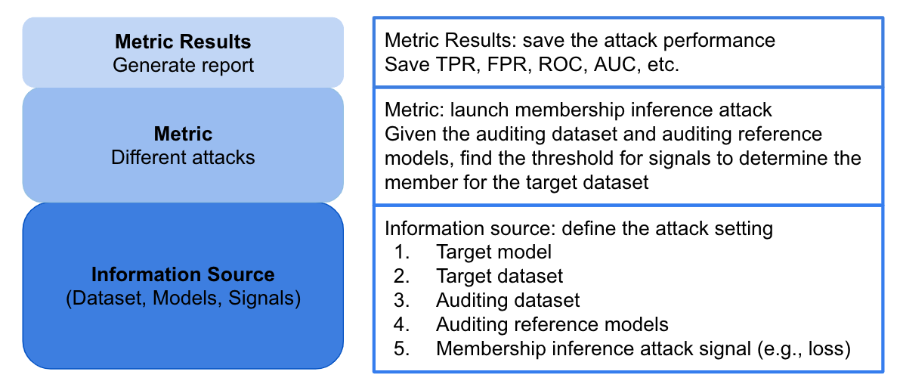

# Privacy Meter

[](https://pypi.org/project/privacy-meter/)
[](https://pepy.tech/project/privacy-meter)
[](https://pypi.org/project/privacy-meter/)
[](https://join.slack.com/t/privacy-meter/shared_invite/zt-1oge6ovjq-SS4UZnBVB115Tx8Nn3TVhA)

[](https://arxiv.org/abs/2007.09339)
[](https://colab.research.google.com/github/privacytrustlab/ml_privacy_meter/blob/master/docs/population_metric.ipynb)


## What is privacy meter?

Privacy Meter is an open-source library to audit data privacy in statistical and machine learning algorithms. The tool can help in data protection impact assessment process by providing a quantitative analysis of fundamental privacy risks of a (machine learning) model. It uses state-of-the-art inference techniques to audit a wide range of machine learning algorithms for classification, regression, computer vision, and natural language processing. Privacy Meter generates extensive reports about the aggregate and individual privacy risks for data records in the training set, at multiple levels of access to the model.

## Why Privacy Meter?

Machine learning is playing a central role in automated decision-making in a wide range of organization and service providers. The data, which is used to train the models, typically contain sensitive information about individuals. Although the data in most cases cannot be released, due to privacy concerns, the models are usually made public or deployed as a service for inference on new test data. For a safe and secure use of machine learning models, it is important to have a quantitative assessment of the privacy risks of these models, and to make sure that they do not reveal sensitive information about their training data. This is of a great importance as there has been a surge in use of machine learning in sensitive domains such as medical and finance applications.

Data Protection regulations, such as GDPR, and AI governance frameworks require personal data to be protected when used in AI systems, and that the users have control over their data and awareness about how it is being used. For example, [Article 35 of GDPR](https://gdpr-info.eu/art-35-gdpr/) requires organizations to systematically analyze, identify and minimize the data protection risks of a project, especially when the project involves innovative technologies such as Artificial Intelligence, Machine Learning and Deep Learning. Thus, proper mechanisms need to be in place to quantitatively evaluate and verify the privacy of individuals in every step of the data processing pipeline in AI systems.

ML Privacy Meter is a Python library (`privacy_meter`) that enables quantifying the privacy risks of machine learning models. The tool provides privacy risk scores which help in identifying data records among the training data that are at high risk of being leaked through the model parameters or predictions.

## Overview

The core of the privacy meter consists of three parts: `Information Source`, `Metric` and `Metric Results`.

<p align="center" width="100%">
    
</p>

Kindly refer to the tutorial on the population attack ([here](tutorials/population_metric.ipynb)) to gain familiarity with the utilization of each component.

## Installation

Privacy Meter supports Python `>=3.6` and works with `tensorflow>=2.4.0` and `torch>=1.10.0`.

You can install `privacy-meter` using `pip` for the latest stable version of the tool:

```bash
pip install privacy-meter
```

Alternatively, one can install it via conda:

```bash
conda install privacy-meter
```

## Quickstart

We provide examples of how to run privacy meter on standard datasets and models in the [experiments](experiments/) folder. Run the following code for your first membership inference attack on CIFAR10.

```
cd experiments
python main.py --cf config_models.yaml
```

Kindly proceed to the experiments folder ([here](experiments/)) to perform privacy audits on various objects, such as models, algorithms, and data points, using the CIFAR10 dataset.

## User manual

### Basic Usage

We have comprehensive tutorials available in the tutorials folder to aid users in comprehending the privacy meter and also offer a default implementation for automatic privacy auditing in the experiments folder. To maximize the benefits of these resources, we recommend following this suggested order:

1. [Acquire a fundamental understanding of the privacy meter by executing a population attack on the CIFAR10 dataset.](tutorials/population_metric.ipynb)
2. [Enhance your knowledge by conducting a reference attack on the CIFAR10 dataset.](tutorials/reference_metric.ipynb)
3. [Automate the privacy auditing process on the CIFAR10 dataset.](experiments/)

### Advanced Usage

Users have the capability to extend our privacy meter to fit their specific needs. By utilizing the code in the experiments folder, one can perform privacy audits on customized training algorithms, datasets, and settings based on different privacy games (See instructions [here](experiments/README.md)). Furthermore, our framework can be extended to include white-box attacks and models developed by other libraries. For more information on this, please refer to the tutorials covering the following topics:

1. [Implementing a simple white-box attack using the privacy meter.](tutorials/white_box_attack.ipynb)
2. [Expanding the privacy meter to encompass OpenVION models.](tutorials/openvino_models.ipynb)
3. [Integrating the privacy meter with HuggingFace models.](tutorials/hf_causal_language_models.ipynb)

## Video (Talks)

- [Auditing Data Privacy in Machine Learning: A Comprehensive Introduction](https://www.sigsac.org/ccs/CCS2022/workshops/workshops.html#:~:text=Auditing%20Data%20Privacy%20in%20Machine%20Learning%3A%20A%20Comprehensive%20Introduction) at CCS 2022, by Reza Shokri.
- [Auditing Data Privacy in Machine Learning](https://youtu.be/sqCd5A1UTrQ) at USENIX Enigma 2022, by Reza Shokri.
- [Machine Learning Privacy Meter Tool](https://youtu.be/DWqnKNZTz10) at HotPETS 2020, by Sasi Kumar Murakonda.

## Contributing

If you wish to add new ways of analyzing the privacy risk or add new model support, please follow our [guidelines](CONTRIBUTING.md).

## Contact / Feedback

Please feel free to join our [Slack Channel](https://join.slack.com/t/privacy-meter/shared_invite/zt-1oge6ovjq-SS4UZnBVB115Tx8Nn3TVhA) to provide your feedback and your thoughts on the project!

## Citing Privacy Meter

To cite this repository, please include the following references (or you can download the [bib file](CITATION.bib)).

1. Jiayuan Ye, Aadyaa Maddi, Sasi Kumar Murakonda, Reza Shokri. [Enhanced Membership Inference Attacks against Machine Learning Models](https://arxiv.org/pdf/2111.09679.pdf) in Proceedings of the 2022 ACM SIGSAC Conference on Computer and Communications Security, 2022.

2. Sasi Kumar Murakonda, Reza Shokri. [MLPrivacy Meter: Aiding Regulatory Compliance by Quantifying the Privacy Risks of Machine Learning](https://arxiv.org/pdf/2007.09339.pdf) in Workshop on Hot Topics in Privacy Enhancing Technologies (HotPETs), 2020.

3. Milad Nasr, Reza Shokri, and Amir Houmansadr. [Comprehensive Privacy Analysis of Deep Learning: Stand-alone and Federated Learning under Passive and Active White-box Inference Attacks](https://www.comp.nus.edu.sg/~reza/files/Shokri-SP2019.pdf) in IEEE Symposium on Security and Privacy, 2019.

4. Reza Shokri, Marco Stronati, Congzheng Song, and Vitaly Shmatikov. [Membership Inference Attacks against Machine Learning Models](https://www.comp.nus.edu.sg/~reza/files/Shokri-SP2017.pdf) in IEEE Symposium on Security and Privacy, 2017.

## Authors

The tool is designed and developed at NUS Data Privacy and Trustworthy Machine Learning Lab.
