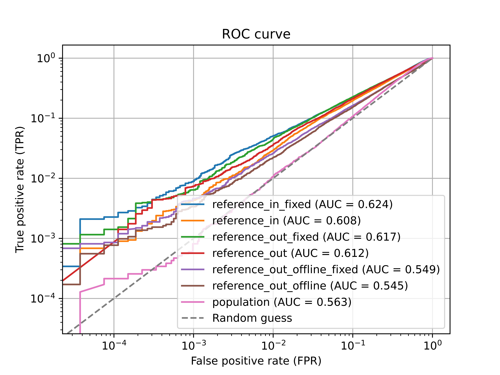

# Benchmark Experiments

This folder contains a script for running benchmark experiments with different methods under the same settings.

## Setting

The target model is trained using 30% of the entire CIFAR10 dataset (referred to as "members") and tested with another 30% of the dataset (referred to as "non-members"). The remaining data is considered population data and will be used for population attacks.

## Running the Script

To obtain all the attack results under this setting, please run the following command (GPU needed. The default GPU id is 1.):
    
```
python main.py --cf benchmark.yaml
```

The results will be saved in the `benchmark` folder within the current directory. In this setting, we train 8 IN reference models and 8 OUT reference models, and 1 target model for producing this benchmark comparison.  Each target data point (from member and non-member set) is included in half of the reference models (referred to as "IN models") and excluded from the other half (referred to as "OUT models").
Our code will run 245 seconds on a Single NVIDIA TITAN RTX to get all results for all attacks, including the training target model and reference models.

## Results
In the following, we present the results for different variants of attacks:
1. `reference_in_out_logits_pdf_fixed`: This attack uses both the IN and OUT models to compute the likelihood ratio for each target data point. The standard deviation of the OUT signals is the same as the IN signals and is constant for all data points. This is from the online attack in the paper (Carlini et al., 2022).
2. `reference_in_out_logits_pdf`: This attack also utilizes both the IN and OUT models to compute the likelihood for each target data point. However, the standard deviation is computed individually for each data point. This is from the online attack in the paper (Carlini et al., 2022).
3. `reference_out_logits_percentile_fixed`: In this attack, only the OUT models are used to compute the signal and compare it with the alpha-percentile of the OUT signal distribution. The standard deviation of the OUT signals is constant for all data points. This is from the reference attack in the paper (Ye et al., 2022).
4. `reference_out_logits_percentile`: Similar to the previous attack, the OUT models are used to compute the signal and compare it with the alpha-percentile of the OUT signal distribution. However, the standard deviation is computed individually for each data point. This is from the reference attack in the paper (Ye et al., 2022).
5. `reference_out_logits_pdf_fixed`: This attack employs the OUT models to compute the probability density function (PDF) of the target signal with respect to the OUT signal distribution. The standard deviation of the OUT signals remains constant for all data points. This is from the offline attack in the paper (Carlini et al., 2022).
6. `reference_out_logits_pdf`: Similar to the previous attack, the OUT models are used to compute the PDF of the target signal with respect to the OUT signal distribution. However, the standard deviation is computed individually for each data point. This is from the offline attack in the paper (Carlini et al., 2022).
7. `population`: This attack utilizes the target model's performance on population data to construct the OUT signal distribution. Each target point's signal is then compared with the alpha-percentile of the OUT signal distribution. This is from the original population attack paper (Ye et al., 2022).

<p align="center" width="100%">
    
</p>