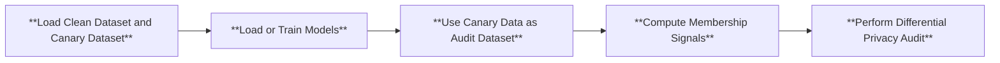

# Auditing Differential Privacy Lower Bound

Could I check whether a training algorithm (that used my data) is differentially private (DP) as claimed? Importantly, how to test the claimed differential privacy guarantee of different training algorithms with confidence guarantees. This question is important in quantitatively interpreting, debugging, and comparing the privacy guarantees of different private learning algorithms.

A DP auditing experiment takes in a randomized algorithm and a confidence tolerance as inputs, and returns a high-confidence statistical lower bound $\hat{\varepsilon}$ for the ground-truth DP parameter, such that it satisfies $\Pr[\hat{\varepsilon}<\varepsilon]\geq 1-\beta$ if the algorithm $T$ is $(\varepsilon, \delta)$-DP, where the probability is over randomness of the auditing experiment and the training algorithm. To design such DP auditing experiment, prior works generally rely on the constraint of $(\varepsilon, \delta)$-DP on the power of binary membership hypothesis test ([Wasserman & Zhou, 2010](https://arxiv.org/abs/0811.2501), [Kairouz et al., 2015](https://arxiv.org/abs/1311.0776)). Thus, one way to achieve more powerful DP auditing is by employing stronger membership inference attacks as the underlying test.

Below, we illustrate how to use our state-of-the-art MIA method, the *Robust Membership Inference Attack (RMIA)* ([Zarifzadeh et al., 2023](https://arxiv.org/abs/2312.03262)), to perform a DP auditing experiment that only requires a few training runs ([Steinke et al., 2023](https://arxiv.org/abs/2305.08846)).


## Structure
We perform the following three modifications to the pipeline.
1. **Dataset Creation:** we perform i.i.d. Poisson sampling from a prespecified `canary dataset`, and then combine the subsampled canary data points with the clean dataset. 
2. **Perform Differential Privacy Audit**: we compute the audited differential privacy lower bounds on top of different number of MIA guesses. 


Below is the flowchart for modified pipeline:



## Canary Dataset

We support two choices of canary datasets for DP auditing of models trained on CIFAR-10, see examples images and their classes below.

1. (Randomly) Mislabelled image as canary data

2. Natural image as canary data (the images with correct labels in CIFAR-10)

To use your own canary dataset, simply modify the following functionality in the `run_audit_dp.py` file.
```python
canary_dataset, _ = load_canary_dataset(configs, directories["data_dir"], logger)
```
To modify the size of the canary dataset, simply modify the `canary_size` field in the configuration files.

## Running
To audit the differential privacy lower bound of a **differentially private training algorithm** using membership inference attack, first install the necessary library for DP training. We use opacus, which can be installed as follows.
```
conda install -c conda-forge opacus
```

To run DP auditing on top of membership inference attacks, under two choices of canary data (mislabelled versus natural images) and two choices of training algorithm (DP versus non-DP), you can use the following commands. 
```
python run_audit_dp.py --cf configs/cifar10_nondp_train_mislabel_1000.yaml
python run_audit_dp.py --cf configs/cifar10_dp_train_mislabel_1000.yaml
python run_audit_dp.py --cf configs/cifar10_nondp_train_natural_1000.yaml
python run_audit_dp.py --cf configs/cifar10_dp_train_natural_1000.yaml
```


## Estimated Running Time

The **estimated total running time** of the above commands on single RTX 3090 is 3600 seconds under non-DP training, and is 5200 seconds under DP training.


## Expected Outputs
The DP auditing results will be printed. And see corresponding `report/dp_audit_average.png` folder for more detailed DP auditing results under various number of MIA guesses. Below we summarize the results.


| Canary Data | Training Algo. | Audited Lower Bound $\hat{\varepsilon}$ under $\delta = 10^{-5}$ |
| :-------- | :-------- | :--------|
|  Mislabelled  |       Non-DP      |     5.4814    |
|  Mislabelled  |       DP ($\varepsilon = 68.51, \delta = 10^{-5}$)           |        0.4181          |
|  Natural      |       Non-DP      |    4.5571     |
|  Natural      |       DP ($\varepsilon = 68.51, \delta = 10^{-5}$)          |        0.1258   |

As shown in the table, stronger canary design (mislabelled images) allow stronger DP auditing results, and differentially private training effective reduce the audited privacy risk lower bound.