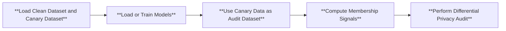

# Auditing Differential Privacy Lower Bound


## Structure
For **auditing differential privacy lower bounds**, we  modify the pipeline in dataset creation by performing i.i.d. Poisson sampling from a prespecified canary dataset, and then combine the subsampled canary data points with the clean dataset. We also extend the pipeline in `perform privacy audit` to provide the audited differential privacy lower bounds under different number of MIA guesses. Below is the flowchart for DP auditing:



## Running
To audit the differential privacy lower bound of a training algorithm using membership inference attack, first install the necessary library for DP training. We use opacus, which can be installed as follows.
```
conda install -c conda-forge opacus
```

To run DP auditing on top of membership inference attacks, you can use the following command

1. Mislabelled image as canary data

For auditing the standard (non-DP) training algorithm
```
python run_audit_dp.py --cf configs/cifar10_dp_train_mislabel_1000.yaml
```
For auditing a DP training algorithm,  first install the necessary library for DP training. We use opacus, which can be installed via running `conda install -c conda-forge opacus`, and then run the following command
```
python run_audit_dp.py --cf configs/cifar10_nondp_train_mislabel_1000.yaml
```

2. Natural image as canary data

For auditing the standard (non-DP) training algorithm
```
python run_audit_dp.py --cf configs/cifar10_nondp_train_natural_1000.yaml
```
For auditing a DP training algorithm, run the following command
```
python run_audit_dp.py --cf configs/cifar10_dp_train_natural_1000.yaml
```
The DP auditing results will be printed. And see corresponding `report/dp_audit_average.png` folder for more detailed DP auditing results under various number of MIA guesses. To use your own canary dataset, simply modidfy the `canary_dataset` field in the configuration files; to modify the size of the canary dataset, simply modify the `canary_size` field in the configuration files.

