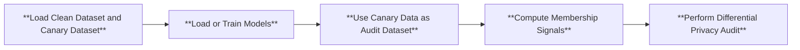
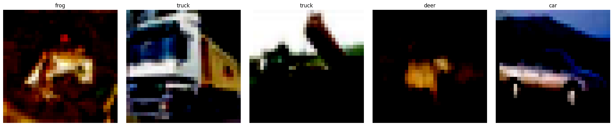

# Auditing Differential Privacy Lower Bound


## Structure
We perform the following three modifications to the pipeline.
1. **Dataset Creation:** we perform i.i.d. Poisson sampling from a prespecified `canary dataset`, and then combine the subsampled canary data points with the clean dataset. 
2. **Perform Differential Privacy Audit**: we compute the audited differential privacy lower bounds on top of different number of MIA guesses. 


Below is the flowchart for modified pipeline:



## Canary Dataset

We support two choices of canary datasets for DP auditing of models trained on CIFAR-10, see examples images and their classes below.

1. Mislabelled image as canary data

2. Natural image as canary data


To use your own canary dataset, simply modify the following functionality in the `run_audit_dp.py` file.
```python
canary_dataset, _ = load_canary_dataset(configs, directories["data_dir"], logger)
```
To modify the size of the canary dataset, simply modify the `canary_size` field in the configuration files.

## Running
To audit the differential privacy lower bound of a **differentially private training algorithm** using membership inference attack, first install the necessary library for DP training. We use opacus, which can be installed as follows.
```
conda install -c conda-forge opacus
```

To run DP auditing on top of membership inference attacks, under two choices of canary data (mislabelled versus natural images) and two choices of training algorithm (DP versus non-DP), you can use the following commands. 
```
python run_audit_dp.py --cf configs/cifar10_nondp_train_mislabel_1000.yaml
python run_audit_dp.py --cf configs/cifar10_dp_train_mislabel_1000.yaml
python run_audit_dp.py --cf configs/cifar10_nondp_train_natural_1000.yaml
python run_audit_dp.py --cf configs/cifar10_dp_train_natural_1000.yaml
```


## Estimated Running Time

The **estimated total running time** of the above commands on single RTX 3090 is 3700 seconds under non-DP training, and is 4800 seconds under DP training.


## Expected Outputs
The DP auditing results will be printed. And see corresponding `report/dp_audit_average.png` folder for more detailed DP auditing results under various number of MIA guesses. Below we summarize the results.


| Canary Data | Training Algo. | Audited Lower Bound $\hat{\varepsilon}$ under $\delta = 10^{-5}$ |
| :-: | :---------------------: | :------------------: |
|  Mislabelled  |       Non-DP      |         |
|  Mislabelled  |       DP $(\varepsilon = , \delta = )$           |                  |
|  Natural      |       Non-DP      |         |
|  Natural      |       DP $(\varepsilon = , \delta = )$           |           |

