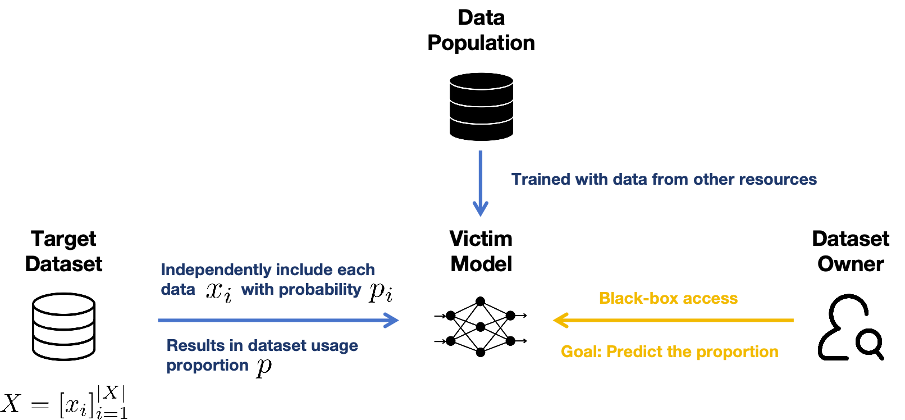
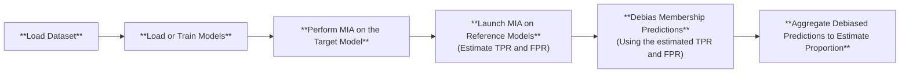

# Dataset Usage Cardinality Inference Attacks
How much of a given dataset was used to train a machine learning model? This is a critical question for data owners assessing the risk of unauthorized data usage and protecting their right (United States Code, 1976). Dataset Usage Cardinality Inference (DUCI) estimats the exact proportion of data used through debiasing and aggregating individual MIA guesses.

## Problem


The Dataset Usage Cardinality Inference (DUCI) algorithm---acting as an agent for the dataset owner with full access to a target dataset---aims to estimate the proportion of the target dataset used in training a victim model, given black-box access to the model and knowledge of the training algorithm (e.g., the population data and model archtecture).


## Method
To estimate the proportion of a target dataset being used, the Dataset Usage Cardinality Inference (DUCI) algorithm first debiases the membership predictions \(\hat{m}_i\) provided by any Membership Inference Attack (MIA) method to obtain the probability of each data record being used, using the following formula:

\[
\hat{p}_i = \frac{\hat{m}_i - P(\hat{m}_i = 1 \mid m_i = 0)}{P(\hat{m}_i = 1 \mid m_i = 1) - P(\hat{m}_i = 1 \mid m_i = 0)},
\]

After debiasing, DUCI aggregates the unbiased probability estimators over the entire dataset to compute the overall proportion:

\[
\hat{p} = \frac{1}{|X|} \sum_{i=1}^{|X|} \hat{p}_i,
\]

where \(|X|\) is the size of the target dataset.

## Pipeline

In Privacy Meter, DUCI is conducted in the following way:

1. Load the target model and launch the membership inference attack on each record in the target dataset.  
2. Launch the same membership inference attack on a reference model (reusing the reference models from MIA if available) to calculate the TPR (\(P(\hat{m} = 1 \mid m = 1)\)) and FPR (\(P(\hat{m} = 1 \mid m = 0)\)) used for debiasing.  
3. Debias the predictions using the estimated errors and aggregate them to estimate the overall proportion.  

Here is the graphical illustration of the process.



## How to use DUCI in Privacy Meter

To run a DUCI on a target model using 50% of the target dataset, you can use the following command

```

python run_duci.py --cf configs/config.yaml

```

You can load your own `signals` (a matrix of shape `dataset_size × total_num_models`) and `memberships` (with the same shape) for inference. For each run, you can specify which model among the `total_num_models` will be the target model and which models will serve as reference models. You can then launch the DUCI process as shown below:

```python
target_model_indices = [0, 1, 2, 3]
reference_model_indices_all = [[2, 3], [2, 3], [0, 1], [0, 1]]

DUCI_instance = DUCI(logger, args)
duci_preds, true_proportions, errors = DUCI_instance.pred_proportions(
    target_model_indices, 
    reference_model_indices_all, 
    signals,
    memberships,
)
```
In this example, there are 4 runs. The target models for the runs are model 0, 1, 2, and 3, respectively, with the corresponding reference models for each run as follows: 

- **Run 1**: Target model is model 0, and the reference models are 2 and 3.  
- **Run 2**: Target model is model 1, and the reference models are 2 and 3.  
- **Run 3**: Target model is model 2, and the reference models are 0 and 1.  
- **Run 4**: Target model is model 3, and the reference models are 0 and 1.  