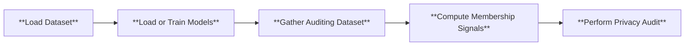

# Membership Inference
## Machine Learning Models Leak Information of Training Data
There is little doubt that the improvement of machine learning (ML) models is partially to the the abundance of data. While learning from data, ML models inevitably memorize some of the training data. In ML, memorization refers to the phenomenon that
ML models behave differently on training data and non-training data. In particular, the model outputs of IN data (training data) will have a distinct distribution compared to those of OUT data. The less overlapped the two distributions are, the more significant the memorization is, which leads to higher leakage.

<div style="display: flex; justify-content: space-between;">
  
  
</div>

This becomes a privacy risk if an adversary can infer the training data from a target ML model as the data can contain sensitive information. In addition, even the "membership" of data is a privacy concern, i.e. being able to determine whether a given data point is part of a training set can leak a lot of information. A typical example for this argument is that once we know a data record is part of the HIV patient dataset, we can conclude the person is an HIV patient. 

Inferring the membership of data is feasible due to the memorization behavior of ML models, even if the adversary only has black box access to the target model, where the adversary can only get to know the model output for given input data.

There are a vast of number of publicly accessible models, either open-sourced or on cloud. Existing attacks have shown impressive attack success rate and result on popular models. We want to raise the public's awareness that ML models can lead to indirect information leakage of data.

## What is Membership Inference Attack
Membership inference attack (MIA), is a class of inference attack that aims to determine whether a given point query is from the training set of a target model. Formally put, the adversary aims to output a binary outcome that indicates whether a data point $x$ is part of the training set of a model $f$. Usually the adversary is assumed to only have access to the prediction API of the target model that outputs $f(x)$ for a given input $x$.

<p align="center">
  
</p>

### Membership Inference Game
In ML security literature, membership inference is often formulated as a game theoretic.

<p align="center">
  
</p>

### Evaluating MIAs
An attack algorithm should assign a numeric score $\text{MIA}(x;f)$ to every query $x$. The membership decision is then obtained by thresholding the membership score. To evaluate the power of the MIA and assess the overall privacy risk of a target model, the commonly used metric is the area under the receiver operating characteristic curve (AUC ROC). The ROC curve has the true positive rate (TPR), which shows the power of the attack, as its y-axis, and the false positive rate (FPR) as its x-axis, which shows the error of the attack. The larger the AUC, the stronger the MIA is. 

## Hypothesis Test for Membership Inference
Given the game formulation of membership inference, we can construct two "worlds":
- the IN world where the given point is part of the training set
- the OUT world where the given point is not part of the training set.

These two worlds can be expressed as the two hypotheses in the hypothesis testing:
- $H_0$: The given point $x$ is part of the training set (IN world)
- $H_1$: The given point $x$ is not part of the training set (OUT world)

<p align="center">
  
</p>

### Test strategy
The strongest attack for this hypothesis testing problem is to use a likelihood ratio test:
$LR(f, x)=\frac{L(H_0|f, x)}{L(H_1|f, x)}$, where $L$ is the likelihood function. If the likelihood ratio falls below a threshold, we reject the null hypothesis and conclude that the given point $x$ is not a member.


### RMIA

## Pipeline
Below is the high level pipeline of the internal mechanism of Privacy Meter, which shows the general procedure involved in auditing privacy according to the configuration.



## How to Run
To run our demo, you can use the following command

```
python main.py --cf configs/config.yaml
```

The `.yaml` file allows you to specify the hyperparameters for training the model, and the details of the membership inference attack. To shorten the time to run the demo, we set the number of epochs to 10. To properly audit the privacy risk, we suggest change the number of epochs to 100 or whatever is appropriate for your use case.

For a comprehensive explanation of each parameter, please refer to each `.yaml` file and the explanation [here](../configs/README.md). You can also refer to the [demo notebook](../demo.ipynb) for a step-by-step walkthrough. 

## Auditing Results
Upon audit completion, you will find the results in the `demo` folder, with the attack results saved in `demo/report`. Furthermore, we also offer a timing log for each run, which can be found in the file `log_time_analysis.log`. We recommend running each new set of experiments with different hyperparameters under a different `log_dir` to avoid misusing old trained models or losing previous results.
### Vision models
Below are the ROC and log scale ROC of the auditing result on CIFAR-10 dataset with a WideResNet.

<div style="display: flex; justify-content: space-between;">
    
    
</div>

### Language generative models

<div style="display: flex; justify-content: space-between;">
    
    
</div>

### Interpolation of the result