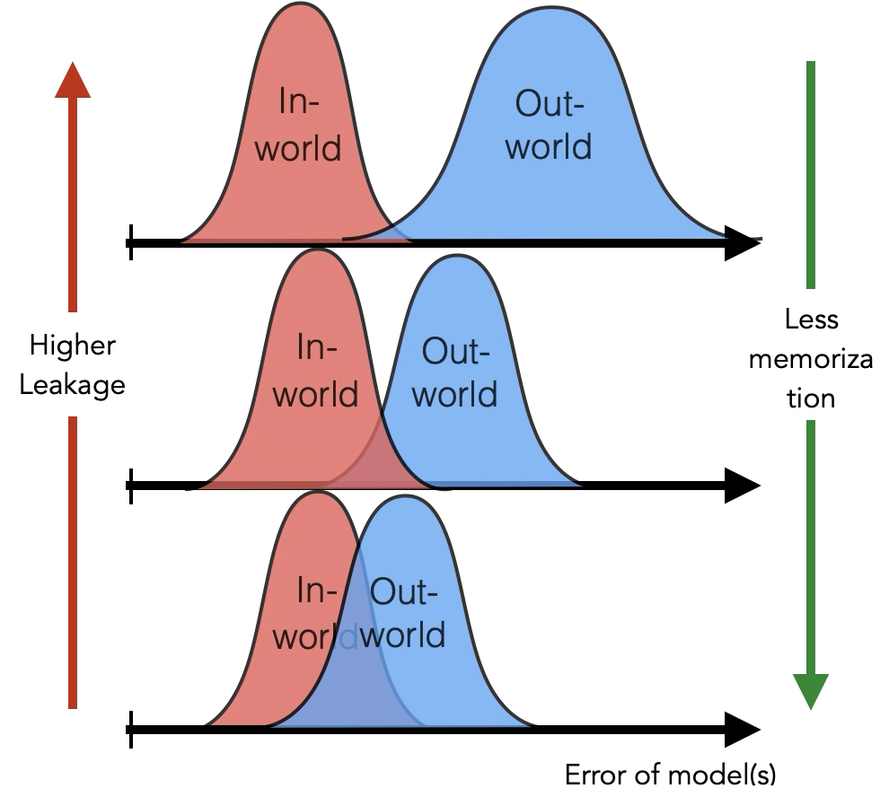
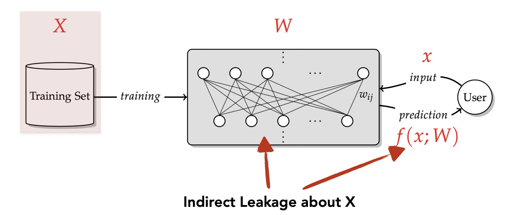
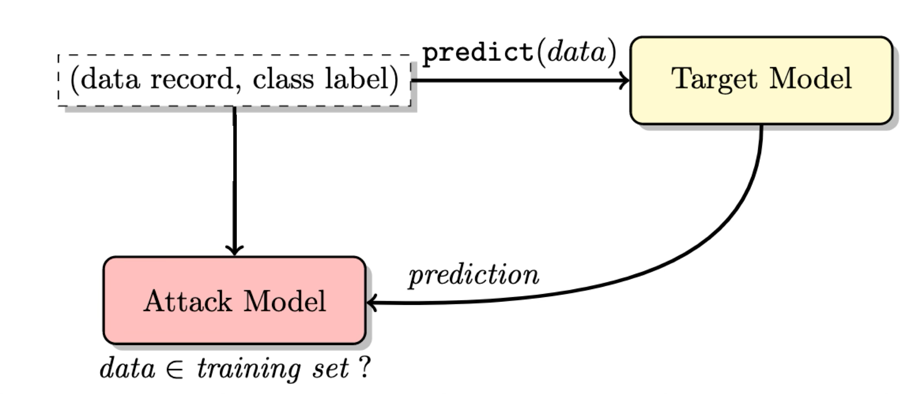
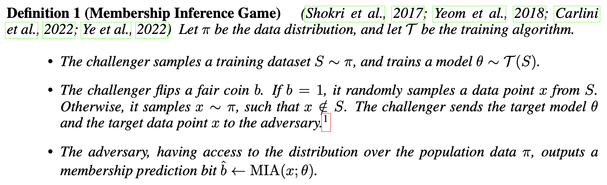
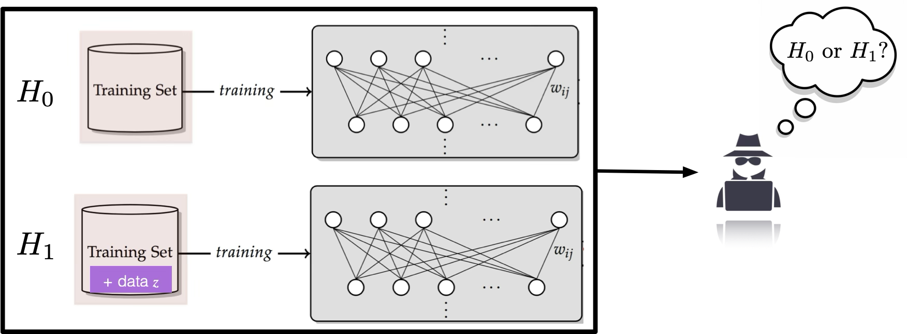
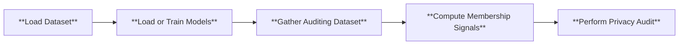

# Membership Inference
## Machine Learning Models Leak Information of Training Data
There is little doubt that the improvement of machine learning (ML) models is partially to the the abundance of data. While learning from data, ML models inevitably memorize some of the training data. In ML, memorization refers to the phenomenon that
ML models behave differently on training data and non-training data. In particular, the model outputs of IN data (training data) will have a distinct distribution compared to those of OUT data. The less overlapped the two distributions are, the more significant the memorization is, which leads to higher leakage.

<div style="display: flex; justify-content: space-between;">
  
  
</div>

This becomes a privacy risk if an adversary can infer the training data from a target ML model as the data can contain sensitive information. In addition, even the "membership" of data is a privacy concern, i.e. being able to determine whether a given data point is part of a training set can leak a lot of information. A typical example for this argument is that once we know a data record is part of the HIV patient dataset, we can conclude the person is an HIV patient. 

Inferring the membership of data is feasible due to the memorization behavior of ML models, even if the adversary only has black box access to the target model, where the adversary can only get to know the model output for given input data.

There are a vast of number of publicly accessible models, either open-sourced or on cloud. Existing attacks have shown impressive attack success rate and result on popular models. We want to raise the public's awareness that ML models can lead to indirect information leakage of data.

## What is Membership Inference Attack
Membership inference attack (MIA) is a class of inference attack that aims to determine whether a given point query is from the training set of a target model. Formally put, the adversary aims to output a binary outcome $b \in [0,1]$ that indicates whether a data point $x$ is part of the training set of a model $f$. Usually the adversary is assumed to only have access to the prediction API of the target model that outputs $f(x)$ for a given input $x$, which makes the attack more feasible on real world models.

<p align="center">
  
</p>

### Membership Inference Game
In ML security literature, membership inference is often formulated as a game theoretic.

<p align="center">
  
</p>

### Evaluating MIAs
An attack algorithm should assign a numeric score $\text{MIA}(x;f)$ to every query $x$. The membership decision is then obtained by thresholding the membership score. To evaluate the power of the MIA and assess the overall privacy risk of the target model, the commonly used metric is the area under the receiver operating characteristic curve (AUC-ROC). The ROC curve uses the true positive rate (TPR), which shows the power of the attack, as its y-axis, and the false positive rate (FPR), which shows the error of the attack, as its x-axis. The larger the AUC, the stronger the MIA is. A clueless attacker that uniformly randomly outputs 1's and 0's will have an AUC of 0.5.

## Hypothesis Test for Membership Inference
Given the game formulation of membership inference, we can construct two "worlds":
- the IN world where the given point is part of the training set
- the OUT world where the given point is not part of the training set.

These two worlds can be expressed as the two hypotheses in the hypothesis testing:
- $H_0$: The given point $x$ is part of the training set (IN world)
- $H_1$: The given point $x$ is not part of the training set (OUT world)

The adversary's task is then to determine which world he is  in with the observable $f$ and $x$.

<p align="center">
  
</p>

### Test strategy
The strongest attack for this hypothesis testing problem is to use a likelihood ratio test (LRT):
$LR(f, x)=\frac{L(H_0|f, x)}{L(H_1|f, x)}$, where $L$ is the likelihood function. If the likelihood ratio falls below a threshold, we reject the null hypothesis and conclude that the given point $x$ is not a member.

### RMIA
There are many ways to formulate the likelihood function $L$ and to construct the threshold. In Privacy Meter, the core membership inference engine is built upon the state-of-the-art method, the *Robust Membership Inference Attack (RMIA)*. RMIA improves membership inference by refining the Likelihood Ratio Test with a more precise null hypothesis and leveraging reference models and population data.

#### Likelihood Ratio Test in RMIA
RMIA is designed as a hypothesis test where the adversary differentiates between two possible worlds:
- **IN world**: The model $ f $ is trained with a member point $ x $.
- **OUT world**: The model $ f $ is trained without $ x $, instead using a different non-member point $ z $.

Following Bayes' rule, RMIA computes the likelihood ratio as:
$$
LR = \frac{P(x | f)}{P(x)} \bigg/ \frac{P(z | f)}{P(z)}.
$$
For simplicity, we define:
$$
P_x = \frac{P(x|f)}{P(x)}, \quad P_z = \frac{P(z|f)}{P(z)}.
$$
Here, $ P_x $ represents a calibrated probability of $ x $, normalized by its probability under all possible models. RMIA improves upon prior approaches by carefully constructing $ P(x) $ using both reference models and population data.

#### Computing the Likelihood of a Data Point
The term $ P(x) $ in the denominator normalizes the probability of observing $ x $ by integrating over all possible models. RMIA estimates it using a set of reference models $ F $:
$$
P(x) = \sum_{f \in F} P(x | f) P(f).
$$
Since each data point can be either IN or OUT for a given model with equal probability, RMIA estimates $ P(f) $ as:
$$
P(f) = 0.5 P_{IN} + 0.5 P_{OUT},
$$
where $ P_{IN} $ and $ P_{OUT} $ are the average probabilities of $ x $ over IN and OUT reference models, respectively. These reference models serve as an approximation of the underlying distribution of models.

However, RMIA further refines the likelihood ratio test by introducing a comparison with **population points**. Instead of relying solely on the probability of the target point $ x $, RMIA evaluates the likelihood ratio relative to many random non-member points $ z $ sampled from the population. This comparison provides a much finer granularity in distinguishing between members and non-members.

For each pair of points $ (x, z) $, RMIA evaluates:
$$
LR(x, z) = \frac{P(x|f)}{P(x)} \bigg/ \frac{P(z|f)}{P(z)}.
$$
By aggregating these pairwise comparisons, RMIA constructs the final membership inference score as:
$$
\text{Score}_{\text{RMIA}}(x, f) = P_{z \sim \pi} \left( LR(x, z) \geq \gamma \right),
$$
where the probability is computed over multiple population points $ z $, and $ \gamma \geq 1 $ is a threshold controlling how much stronger $ x $'s likelihood should be compared to $ z $ in order to infer membership. The default value of $\gamma$ is 1.

#### Training Reference Models
To approximate $ P(x) $, RMIA relies on reference models that are trained with the same architecture and methodology as the target model. Following the methodology in *LiRA* and *RMIA*, each reference model is trained on a randomly selected half of the dataset. Given a dataset of $ N $ samples, each reference model is trained on a subset of $ N/2 $ samples, ensuring that every data point is included in approximately half of the models (IN models) and excluded from the other half (OUT models). This setup ensures a balanced and unbiased estimation of likelihoods.

#### Offline Attack
In practical settings, an adversary may only have access to OUT data, preventing them from training IN models for every target point. RMIA addresses this limitation in the **offline attack setting** by approximating $ P_{IN} $ using $ P_{OUT} $ with a scaling factor:
$$
P_{IN} = a \cdot P_{OUT} + (1-a), \quad 0 \leq a \leq 1.
$$
This allows RMIA to perform robust membership inference without requiring custom-trained IN models, making it computationally efficient. The hyperparamter $a$ is determined with a grid search. by setting a reference model as the temporary target model and attacking it with all other reference models.


## Pipeline
Below is the high level pipeline of the internal mechanism of Privacy Meter, which shows the general procedure involved in auditing privacy according to the configuration.



## How to Run
To run our demo, you can use the following command

```
python main.py --cf configs/config.yaml
```

The `.yaml` file allows you to specify the hyperparameters for training the model, and the details of the membership inference attack. To shorten the time to run the demo, we set the number of epochs to 10. To properly audit the privacy risk, we suggest change the number of epochs to 100 or whatever is appropriate for your use case.

For a comprehensive explanation of each parameter, please refer to each `.yaml` file and the explanation [here](../configs/README.md). You can also refer to the [demo notebook](../demo.ipynb) for a step-by-step walkthrough. 

## Auditing Results
Upon audit completion, you will find the results in the `demo` folder, with the attack results saved in `demo/report`. Furthermore, we also offer a timing log for each run, which can be found in the file `log_time_analysis.log`. We recommend running each new set of experiments with different hyperparameters under a different `log_dir` to avoid misusing old trained models or losing previous results.
### Vision models
Below are the ROC and log scale ROC of the auditing result on CIFAR-10 dataset with a WideResNet.

<div style="display: flex; justify-content: space-between;">
    
    
</div>

### Language generative models

<div style="display: flex; justify-content: space-between;">
    
    
</div>

### Interpolation of the result