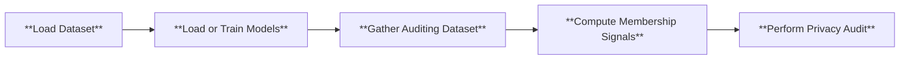

# Membership Inference Attacks
How much privacy is leaked by a given model/training algorithm? This question is often referred to as the privacy auditing problem in the field of machine learning privacy, and the de-facto solution is membership inference attacks (MIAs). 

## Pipeline
Below is the high level pipeline of the internal mechanism of Privacy Meter, which shows the general procedure involved in auditing privacy according to the configuration.



## How to Run
To run our demo, you can use the following command

```
python main.py --cf configs/config.yaml
```

The `.yaml` file allows you to specify the hyperparameters for training the model, and the details of the membership inference attack. To shorten the time to run the demo, we set the number of epochs to 10. To properly audit the privacy risk, we suggest change the number of epochs to 100 or whatever is appropriate for your use case.

For a comprehensive explanation of each parameter, please refer to each `.yaml` file and the explanation [here](../configs/README.md). You can also refer to the [demo notebook](../demo.ipynb) for a step-by-step walkthrough. 

## Auditing Results
Upon audit completion, you will find the results in the `demo` folder, with the attack results saved in `demo/report`. Furthermore, we also offer a timing log for each run, which can be found in the file `log_time_analysis.log`. We recommend running each new set of experiments with different hyperparameters under a different `log_dir` to avoid misusing old trained models or losing previous results.

Below are the ROC and log scale ROC of the auditing result on CIFAR-10 dataset with a WideResNet.

<div style="display: flex; justify-content: space-between;">
    
    
</div>