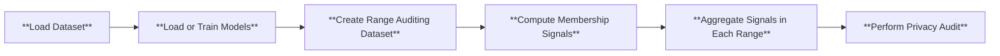

# Range Membership Inference Attacks
[Range membership inference attacks](https://arxiv.org/pdf/2408.05131) empower more comprehensive privacy auditing by accounting for privacy leakage from data similar to training points. The main difference between RaMIA and MIA is that RaMIA takes in a **range query** and predicts if it contains any training point. A range query normally comprises a range center, a range function and a range size. A simple way to visualize a range query is to imagine a $\ell_p$ ball of a given size (range size) defined in a given distance function (range function) centered at a point (range center).

## Use Cases
RaMIA should be the recommended class of inference attacks to use if the attacker is not confident that auditing/attack set contains the exact training points, since the game formulation of the membership inference attacks explicitly builds upon the exact match of training points. In this way, although "noisy" training points can leak privacy, they are, by definition of the membership inference game, non-members. This limitation can fail to detect points that are not exact matches, but privacy leaking to certain extent, leading to suboptimal privacy auditing performance. 

Here we outline a few scenarios where RaMIAs should be favored over MIAs:
1. Testing if any variation (e.g. flipping, rotation, small perturbation) of a point is used in training.
2. Testing information leakage with partial data records (e.g. with missing or redacted features).
3. Testing if other data from the same owner are used in training.
4. Evaluating data reconstruction attack by predicting if a given point is within the specific distance to any training point.
5. Evaluating machine unlearning algorithms by measuring privacy leakage from similar data to the unlearned data.

## Pipeline
In Privacy Meter, RaMIA is conducted to audit privacy in the following way (the highlighted parts are those differ from the MIA):
1. Load the dataset and target and reference models. Train the models on the dataset if needed.
2. **Instantiate the range dataset by creating a range around each point query in the dataset, together with the user-specified range function and size.**
3. Compute membership scores on **sampled points in each range**.
4. **Aggregate the membership scores in each range as the range membership scores.**
5. Audit the privacy risk by computing the AUCROC with the membership scores and true **range membership** status.

Here is the graphical illustration of the process.



## Implementation Details
### Creating the range dataset
The range dataset is created out of a "normal" dataset used to train models. Each range query is wrapped around each original training point with a range sampler, which is created from the specified range function and range size in the config file. The class definition of range dataset and sampler can be found in this [file](dataset/range_dataset.py). Sampling is lazy, which means the range sampler that samples points within each range will not start unless the range dataset is explicitly indexed (e.g. in the signal computation step). 

### Aggregating membership scores within each range
In the [paper](https://arxiv.org/pdf/2408.05131), the aggregation method is to compute the trimmed means. We implement this [here](ramia_scores.py) with an additional averaging option, which can serve as a baseline for comparison. Given this modularity, other aggregation methods can be easily added.

## How to use RaMIA in Privacy Meter
To audit privacy using range membership inference, you can use the following command
```
python run_range_mia.py --cf configs/ramia/config.yaml
```
We provide a template of the config file at this [folder](configs/ramia/). The explanations of each field in the config can be found in this [document](configs/ramia/README.md).

## Auditing Results
The auditing results will be stored in the same way as running the base membership inference attack. They can be found at `<log_dir>/report_ramia`. The `exp/attack_result_x.npz` file contains the FPR, TPR, AUC, TPR at small FPR values from attacking target model `x`. A plot of the ROC can also be found at the same folder. Here we attach a sample ROC and log scale ROC by attacking the Purchase-100 dataset with L2 distance being the range function and 10 being the range size.

<div style="display: flex; justify-content: space-between;">
    
    
</div>
