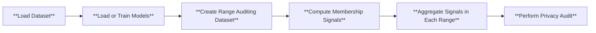

# Range Membership Inference Attacks
[Range membership inference attacks](https://arxiv.org/pdf/2408.05131) empower more comprehensive privacy auditing by accounting for privacy leakage from data similar to training points. The main difference between RaMIA and MIA is that RaMIA takes in a **range query** and predicts if it contains any training point. A range query normally comprises 

## Use Cases
RaMIA should be the attack class to use if the attacker is not confident that auditing/attack set contains the exact training points. Although "noisy" training points can leak privacy, they are, by definition of the membership inference game, non-members. 

1. Testing if any variation (e.g. flipping, rotation, small perturbation) of a point is used in training.
2. Testing privacy leakge with partial data records (e.g. with missing or redacted features).
3. Testing if other data from the same owner are used in training.
4. Evaluating data reconstruction attack by predicting if a given point is within the specific distance to any training point.
5. Evaluating machine unlearning algorithms by measuring privacy leakge from similar data to the unlearned data.

## Pipeline
In Privacy Meter, RaMIA is conducted to audit privacy in the following way:
1. Load the dataset and target and reference models. Train the models on the dataset if needed.
2. Instantiate the range dataset by creating a range around each point query in the dataset, together with the user-specified range function and size.
3. Compute membership scores on sampled points in each range.
4. Aggregate the membership scores in each range as the range membership scores.
5. Audit the privacy risk by computing the AUCROC with the membership scores and true range membership status.

Here is the graphical illustration of the process.



## How to use RaMIA in Privacy Meter
To audit privacy using range membership inference, you can use the following command
```
python run_range_mia.py --cf configs/config_range.yaml
```
We provide a template of the config file at this [folder](configs/ramia/). The explanations of each field in the config can be found in this [document](configs/ramia/README.md).