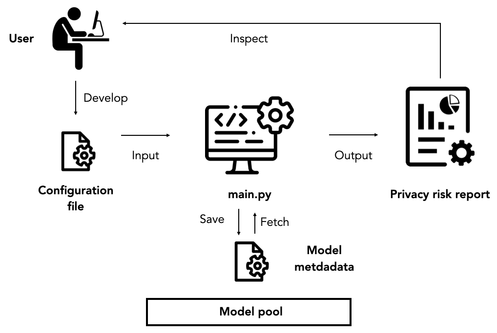

# Privacy Meter Experiments

This folder contains the implementation of an end-to-end membership inference attack, based on various attack games defined by [[Ye et al. 2022](https://arxiv.org/pdf/2111.09679.pdf)] and different attack algorithms. It is recommended that you perform privacy auditing using our automatic pipeline. By default, the audit provides a way to evaluate the privacy risks for models, algorithms, and data points using the CIFAR10 dataset. The training configurations can then be specified in the configuration YAML file. The overall pipeline is illustrated below. For a deeper understanding of various types of attacks or for information on how to extend the Privacy Meter to include other libraries, please refer to our [tutorials](../tutorials) for more information.

    

## Privacy Game

In Ye et al., 2022, four different privacy games widely used in the literature are summerized. Users can specify which privacy game they want to run in the YAML configuration file by setting the `audit.privacy_game` to the following values:

- `avg_privacy_loss_training_algo` - Game 3.1
  This privacy game defines how to audit the privacy risk for a training algorithm. An example configuration is provided in `config_algorithms.yaml`. The privacy risk for a training algorithm is the average privacy risk over records and the models trained by the algorithm, in the sense that the target datasets and the target models are randomly generated. The figure `demo_algorithms/report_population_loss/Histogram.png` shows the loss distribution of the target model on the members and non-members, and the figure `demo_algorithms/report_population_loss/ROC.png` shows the aggregated ROC of the population attack in attacking 16 models trained on random samples drawn from the population with the same training algorithm.

- `privacy_loss_model` - Game 3.2
  This privacy game defines how to audit the privacy risk for a trained model. An example configuration is provided in `config_models_population.yaml`. This game is similar to Game 3.1, except that the target dataset and target models are fixed. The figure `demo_models/report_population_loss/Histogram.png` shows the loss distribution of the target model on the members and non-members and the figure `demo_models/report_population_loss/ROC.png` shows the ROC of the population attack in attacking a trained model.

- `privacy_loss_sample` (uniform) - Game 3.3
  This privacy game defines how to audit the privacy risk for a sample. An example configuration is provided in `config_samples.yaml`. This privacy game captures the privacy risk for a fixed data record where the adversary needs to distinguish models trained with and without the target sample. The figure `demo_samples/report_sample_loss/individual_pr_100_100.png` shows the loss distribution of the target point (data with index 100) for the models trained with it and models trained without it and the figure `demo_samples/report_sample_loss/individual_pr_roc_100_100.png` shows the ROC of the adversary in distinguishing the two types of models. Note that the rest of the training data points for different models are sampled uniformly from the underlying data distribution.

- `privacy_loss_sample` (leave one out) - Game 3.4
  This privacy game defines how to audit the privacy risk for a sample when the rest of the point is known to the adversary. An example configuration is provided in `config_samples_leave_one_out.yaml`. This game is similar to Game 3.3, except that the training dataset is fixed. In other words, the game quantifies the privacy risk of a target data record with regard to a fixed dataset. The figure in `demo_samples` shows the loss distribution of the target point (data with index 1000) for the models trained with it and models trained without it. The figure `demo_samples_leave_one_out/report_sample_loss/individual_pr_100_100.png` shows the loss distribution of the target point (data with index 100) for the models trained with it and models trained without it and the figure `demo_samples_leave_one_out/report_sample_loss/individual_pr_roc_100_100.png` shows the ROC of the adversary in distinguishing the two types of models. Note that the rest of the training datasets for all models is the same.

## Attack Algorithm

The adversary simulates the privacy game above to compute how likely the target point is a member. Specifically, there are three ways to simulate the game, which corresponds to three different types of attacks:

- `reference_out`
  The adversary trains a set of reference models on datasets excluding the target point (OUT models). An example configuration is provided in `config_models_reference_out.yaml`.

- `reference_in_out`
  The adversary trains a set of reference models on datasets including the target point (IN models) and a set of reference models on datasets excluding the target point (OUT models). An example configuration is provided in `config_models_reference_in_out.yaml`.

- `population`
  The adversary does not train any models but queries the target model on a dataset disjoint from the target dataset. An example configuration is provided in `config_models_population.yaml`.

## Signal

We support different attack signals, which is defined by `audit.signal` in the configuration file.Currently, we support the following two signals:

- `loss`
  This is the classification loss that the target model is trained to minimize.
- `rescaled_logits`
  This is the rescaled logits, which is $\log (p/1-p)$, where $p$ is the probability of predicting the correct label.

## Others

### Datasets and Models

Privacy Meter supports various datasets widely used in the MIA literature, including CIFAR10 (`cifar10`), CIFAR100 (`cifar100`), Purchase (`purchase100`), and Texas (`texas100`). In terms of models, we provide support for CNN (`cnn`), AlexNet (`alexnet`), WideResNet (`wrn28-1`, `wrn28-2`, `wrn28-10`), and NN (`nn`) models. To specify the dataset and model, you can use the `dataset` and `model_name` parameters in the configuration file. To add dataset, models or training algorithms for your specific use case, you can add the model structure in `model.py`, the dataset in `dataset.py`, and the training algorithm in `train.py`.

### Efficient Training

We have integrated the fast training library, [hlb-CIFAR10](https://github.com/tysam-code/hlb-CIFAR10), developed by [tysam-code](https://github.com/tysam-code), into Privacy Meter. This library achieves an impressive training accuracy of 94% on CIFAR-10 in approximately 6.84 seconds on a single A100 GPU, setting a new world speed record. This integration allows users to efficiently evaluate the effectiveness of the newly proposed algorithm against existing attack algorithms using the CIFAR-10 dataset. To leverage this fast training library, simply specify the `model_name` as `speedyresnet` in the configuration file. In addition, `speedyresnet` has its own hyper-parameters from `hlb-CIFAR10`, e.g., learning rate, weight decay, etc. The hyper-parameter defined in configuration files will not have an impact on the model training. You can set `optimizer` to `speedyresnet_optimizer`, `learning_rate` to `speedyresnet_learning_rate`, `weight_decay` to `speedyresnet_weight_decay`, `batch_size` to `speedyresnet_batch_size` and `epochs` to `speedyresnet_epochs`. Note that the size of the test dataset used for evaluating the model during training, denoted as `num_test_size`, must be divisible by the batch size `test_batch_size`.

### Argumented queries

When computing the signals from the target model or reference model, we support argument queries. For instance, for each target point, we can query the model loss on the argument target points (e.g., random cropped images from the target image). You can implement your own argumentation queries in `argumented_query.py`.

### Video Tutorial

We also provide video tutorial about Privacy Meter [here](https://drive.google.com/file/d/1wAxzlb8Oy67OCa95JXKPlFiJb0T2e39Y/view?usp=drive_link).
