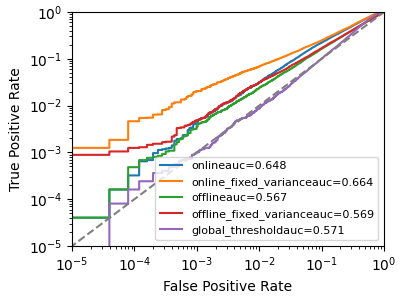
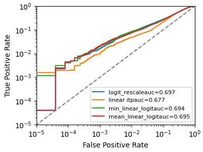
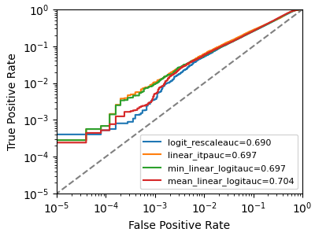

# Enhanced Membership Inference Attacks for Machine Learning Models

This folder contains code to reproduce Attack S[hadow], P[opulation], R[eference] and D[istillation] in our paper

Enhanced Membership Inference Attacks for Machine Learning Models
Jiayuan Ye, Aadyaa Maddi, Sasi Kumar Murakonda, Vincent Bindschaedler and Reza Shokri
[arXiv preprint arXiv:2111.09679](https://arxiv.org/abs/2111.09679)

This directory focus on reproducing the performance of our Attack R and D, as well as reproducing our performance comparison with the LiRA attack [Carlini et. al] in Figure 8 of our paper. You can also see more examples for implementing our attack S[hadow], P[opulation], R[eference] in the privacy meter tool documents: https://github.com/privacytrustlab/ml_privacy_meter/tree/master/docs

## Installation

See `requirements.txt` and `2022_enhanced_mia.yml` for more details. We also provide the detailed setup steps below.

1. Create conda environment, install Cuda Toolkit, CuDNN, set path and install cuda-nvcc

```
conda create --name 2022_enhanced_mia python==3.8.10
conda activate 2022_enhanced_mia
conda install -c conda-forge cudatoolkit=11.3 cudnn=8.2.0
conda install -c nvidia/label/cuda-11.3.1 cuda-nvcc
```

2. Install pip and tensorflow and verify the installation. Install privacy meter from source and install other requirements

```
export LD_LIBRARY_PATH=$LD_LIBRARY_PATH:$CONDA_PREFIX/lib/
conda install -n 2022_enhanced_mia pip
python3 -m pip install tensorflow==2.9.2
python3 -c "import tensorflow as tf; print(tf.config.list_physical_devices('GPU'))"
pip3 install -e ../../.
pip3 install -r requirements.txt
```

3. Install jax and objax for reproducing the LiRA attack in [1] (following https://github.com/google/objax and https://objax.readthedocs.io/en/latest/installation_setup.html)
```
pip install --upgrade objax
RELEASE_URL="https://storage.googleapis.com/jax-releases/jax_cuda_releases.html"
JAX_VERSION=`python3 -c 'import jax; print(jax.__version__)'`
pip uninstall -y jaxlib
pip install -f $RELEASE_URL jax[cuda]==$JAX_VERSION
export XLA_PYTHON_CLIENT_PREALLOCATE=false
```

## Reproducing our comparison baseline LiRA attack in Carlini et. al. 2021

Thanks to the released code by the authors of **Membership Inference Attacks From First Principles** in https://github.com/tensorflow/privacy/tree/master/research/mi_lira_2021, we reproduce their attacks as follows. We also explain our minor modifications to their code (for output processing) in the code comments.

First, we run the following command to train 16 shadow models.

```
mkdir logs
./scripts/cifar10_wrn28-2_16_noaug.sh
```

We now rename the last experiment as the target model (that is also used later in our attacks). We use prefix `z` to ensure that it is accessed the last among all the sorted experiments.

```
mv exp/cifar10_wrn28-2_16_noaug/experiment-15_16 exp/cifar10_wrn28-2_16_noaug/experiment-z_target_model
```

Run the following command to perform the Carlini et. al. 2021 membership inference attacks, and generate attack performance reports
```
python inference.py --logdir=exp/cifar10_wrn28-2_16_noaug/
python score.py exp/cifar10_wrn28-2_16_noaug/
mkdir exp/cifar10_wrn28-2_16_noaug/_tmp
python plot_modified.py exp/cifar10_wrn28-2_16_noaug/
```




## Performing our attack R on the same target model

We first train 29 reference models on random subsets of the population pool.
```
mkdir exp/cifar10_wrn28-2_16_reference
cp exp/cifar10_wrn28-2_16_noaug/x_train.npy exp/cifar10_wrn28-2_16_reference/x_train.npy
cp exp/cifar10_wrn28-2_16_noaug/y_train.npy exp/cifar10_wrn28-2_16_reference/y_train.npy
./scripts/cifar10_wrn28-2_16_reference.sh
```

We then copy the target model to the reference folder.
```
cp -r exp/cifar10_wrn28-2_16_noaug/experiment-z_target_model exp/cifar10_wrn28-2_16_reference/experiment-z_target_model
```

Now, we perform inference to obtain the loss values for launching attack R
```
python inference.py --logdir=exp/cifar10_wrn28-2_16_reference/
python score_losses.py exp/cifar10_wrn28-2_16_reference/
python preprocess_for_privacymeter.py exp/cifar10_wrn28-2_16_reference/
```

We then run the reference model attack. You can pick one of the following three options depending on your interest.
1. run the following command that plots the results for all four smoothing methods (takes less than 1 minute)

```
python plot_attack_via_reference_or_distill.py exp/cifar10_wrn28-2_16_reference/
```



2. proceed to the notebook `attack_via_reference_or_distill.ipynb` for comparing all four smoothing methods in privacy meter tool (takes about 40 minutes to run because it does not use sweeping for efficient evaluation) 

## Performing our attack D (on soft label) on the same target model

We first copy the target model and training dataset to our folder, to ensure that our distillation attack is performed on the same target model and training setup.

```
mkdir exp/cifar10_wrn28-2_16_distill_softlabel
cp -r exp/cifar10_wrn28-2_16_noaug/experiment-z_target_model exp/cifar10_wrn28-2_16_distill_softlabel/experiment-z_target_model
cp exp/cifar10_wrn28-2_16_noaug/x_train.npy exp/cifar10_wrn28-2_16_distill_softlabel/x_train.npy
cp exp/cifar10_wrn28-2_16_noaug/y_train.npy exp/cifar10_wrn28-2_16_distill_softlabel/y_train.npy
```

We then generate soft labels of the target model on training dataset, to form distillation dataset.

```
python score_predictions.py exp/cifar10_wrn28-2_16_distill_softlabel/
```

This will generate a new file for the predictions of the target model (i.e., soft labels).
```
exp/cifar10_wrn28-2_16_distill_softlabel/
- experiment-z_target_model
-- predictions/
--- 0000000100.npy
```

We then train distilled models as follows.

```
./scripts/cifar10_wrn28-2_16_distill_softlabel.sh
```

Now, we perform inference to obtain the loss values for launching attack D
```
python inference.py --logdir=exp/cifar10_wrn28-2_16_distill_softlabel/
python score_losses.py exp/cifar10_wrn28-2_16_distill_softlabel/
python preprocess_for_privacymeter.py exp/cifar10_wrn28-2_16_distill_softlabel/
```

We then to run the distillation attack, you can choose either of the following options.

1. run the following command (takes less than a minute)

```
python plot_attack_via_reference_or_distill.py exp/cifar10_wrn28-2_16_distill_softlabel/
```



2. Alternatively if you want to evaluate the distillation attack in the privacy meter tool, you can replace the line `logdir = "exp/cifar10_wrn28-2_16_reference"` with  `logdir = "exp/cifar10_wrn28-2_16_distill_softlabel"` in the notebook `attack_via_reference_or_distill.ipynb` and run the notebook (takes around 40 minutes).


## References

[1] Carlini, N., Chien, S., Nasr, M., Song, S., Terzis, A., & Tramer, F. (2022, May). Membership inference attacks from first principles. In 2022 IEEE Symposium on Security and Privacy (SP) (pp. 1897-1914). IEEE.