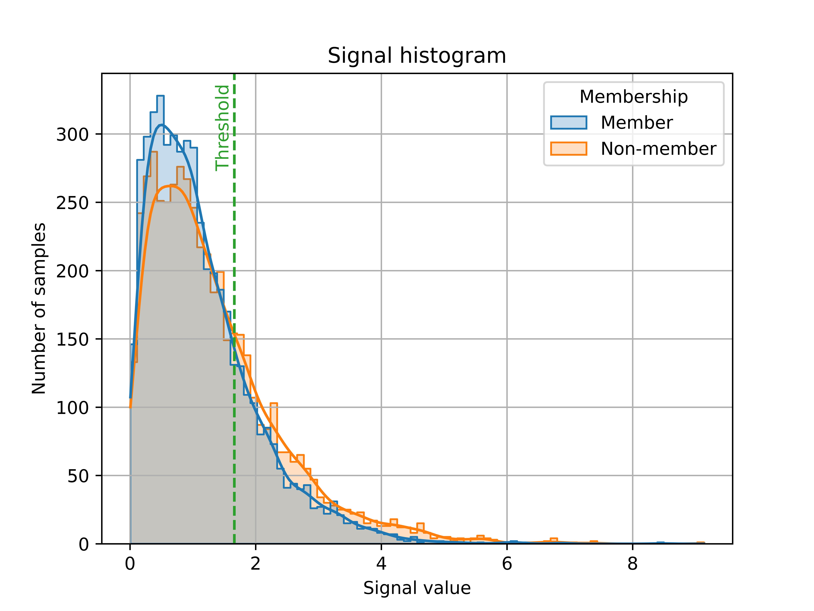
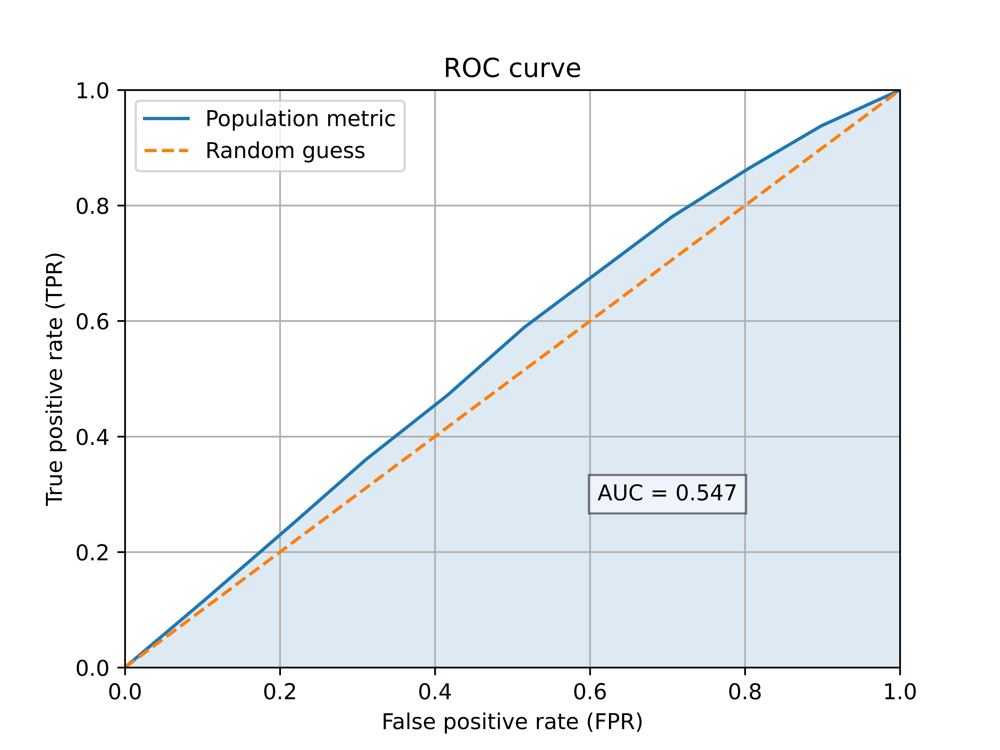

.. Privacy Meter documentation master file, created by
   sphinx-quickstart on Thu Mar 17 15:24:25 2022.
   You can adapt this file completely to your liking, but it should at least
   contain the root `toctree` directive.

=========================================
Welcome to Privacy Meter's documentation!
=========================================

.. warning::
   This library and the associated documentation are working drafts. A stable version will be released to ``PyPi`` shortly.

Overview
========

This tool is designed to be used by a wide variety of users, from trustworthy ML researchers to non-technical users.

Trustworthy ML researchers can use the wrapper from the library to implement their own audits.

Non-technical users can use built-in audit functions to test their ML workflow vulnerability.

Installation
^^^^^^^^^^^^

Privacy Meter supports Python ``>=3.6`` and works with ``tensorflow>=2.4.0`` and ``torch>=1.10.0``.

You can clone this repository and install the local version of tool with its dependencies by running the following:

.. code-block:: shell-session

   pip install -r requirements.txt
   pip install -e .

We will be publishing the tool to ``PyPi`` shortly so you can install the tool directly using ``pip``.

   Figure 1: Loss histogram on a population metric audit

   Figure 2: ROC curve on a population metric audit

Usage
^^^^^

Examples of using the tool can be found in the ``docs/`` directory. The tutorials are provided as Jupyter notebooks.

References
^^^^^^^^^^

1. Jiayuan Ye, Aadyaa Maddi, Sasi Kumar Murakonda, Reza Shokri. `Enhanced Membership Inference Attacks against Machine Learning Models <https://arxiv.org/pdf/2111.09679.pdf>`_ arXiv preprint arXiv:2111.09679
2. Milad Nasr, Reza Shokri, and Amir Houmansadr. `Comprehensive Privacy Analysis of Deep Learning: Stand-alone and Federated Learning under Passive and Active White-box Inference Attacks <https://www.comp.nus.edu.sg/~reza/files/Shokri-SP2019.pdf>`_ in IEEE Symposiumon Security and Privacy, 2019.
3. Reza Shokri, Marco Stronati, Congzheng Song, and Vitaly Shmatikov. `Membership Inference Attacks against Machine Learning Models <https://www.comp.nus.edu.sg/~reza/files/Shokri-SP2017.pdf>`_ in IEEE Symposium on Security and Privacy, 2017.

Contributors
^^^^^^^^^^^^

The tool is designed and developed at NUS Data Privacy and Trustworthy Machine Learning Lab.

Current contributers are: Aadyaa Maddi, Jiayuan Ye, Sasi Kumar Murakonda, Victor Masiak, and Reza Shokri.

Earlier contributors were Milad Nasr, Shadab Shaikh, and Mihir Harshavardhan Khandekar.

.. image:: https://www.comp.nus.edu.sg/~reza/img/aadyaa.jpg
   :width: 100px
   :alt: Aadyaa Maddi

.. image:: https://www.comp.nus.edu.sg/~reza/img/jiayuan.jpg
   :width: 100px
   :alt: Jiayuan Ye

.. image:: https://www.comp.nus.edu.sg/~reza/img/sasi.jpg
   :width: 100px
   :alt: Sasi Kumar Murakonda

.. image:: https://www.comp.nus.edu.sg/~reza/img/victor.jpg
   :width: 100px
   :alt: Victor Masiak

.. image:: https://www.comp.nus.edu.sg/~reza/img/reza.jpg
   :width: 100px
   :alt: Reza Shokri

Indices and tables
==================

* :ref:`genindex`
* :ref:`modindex`
* :ref:`search`

.. toctree::
   :maxdepth: 2
   :caption: Contents:

   modules
